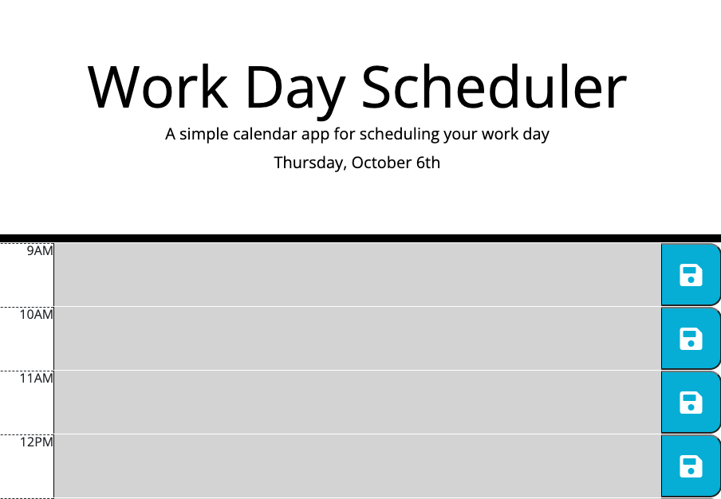

# work-day-scheduler

## Description
This is a daily schedule manager helping people to manage their time much more effectively.

## Tech used
- HTML
- CSS
- JavaScript
- Bootstrap
- Moment js library
- GitHub
- Terminal
- Visual Studio Code

## Use
- Step 1: Open this daily schedule browser.
- Step 2: Write down to-do list at the certain time per user's request.
- Step 3: Click the save button to store their updated schedule.

## Learning point
- I learn how to take use of Bootstrap CDN to make my own style. 
- I learn how to utilize Moment js library to insert the format for date and time.
- I learn how to utilize syntax of jQuery to write a funciton of local storage.

## Link
https://yingyliu.github.io/password-generator/

## License
Please refer to the LICENSE in the repo.